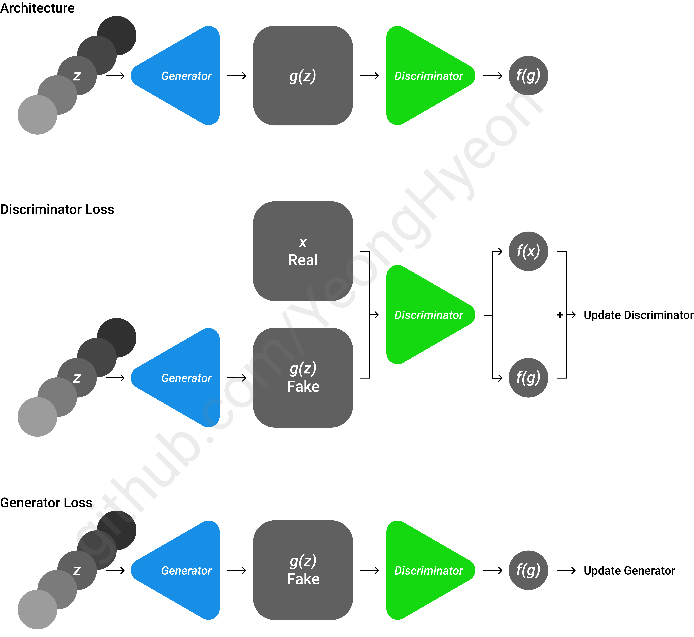

[TensorFlow] Wasserstein GAN (WGAN)
=====
TensorFlow implementation of Wasserstein GAN (WGAN) with MNIST dataset.  

## Architecture

    
  
The algorithm for training WGAN [1].

    
  
The architecture and loss functions of WGAN [1].

## Results

## Environment
* Python 3.7.4  
* Tensorflow 1.14.0  
* Numpy 1.17.1  
* Matplotlib 3.1.1  
* Scikit Learn (sklearn) 0.21.3  

## Reference
[1] Martin Arjovsky et al. (2017). <a href="https://arxiv.org/abs/1701.07875">Wasserstein GAN</a>. arXiv preprint arXiv:1701.07875.  
